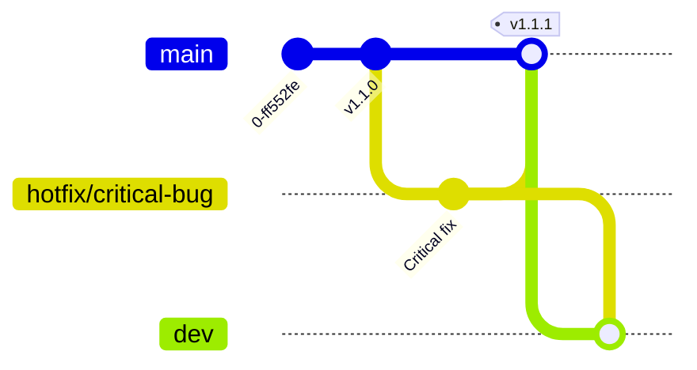

# Contributing to SoundFood Repositories

This document defines the **contribution guidelines** for repositories within the **SoundFood** GitHub organization.

It applies to all projects unless explicitly stated otherwise in a specific repository.

---

## 1. Scope & Philosophy

SoundFood repositories mainly contain **production-ready software** and **prototyping code** developed by a team with a strong **research and engineering background**.

Even when projects originate from R&D activities, the long-term goal is to:

* Maintain **clean, reproducible, and documented code**
* Minimize one-off or throwaway implementations
* Enable smooth transition from prototype to production

Engineering quality is considered a **first-class requirement**.

---

## 2. Repository Types

Most repositories fall into one or more of the following categories:

* **Backend services / APIs**
* **Frontend applications**
* **Infrastructure / DevOps**
* **R&D / ML / AI** (currently limited, but growing)

All repositories are expected to follow the same **baseline engineering standards**, with additional requirements for research-oriented code (see Section 6).

---

## 3. Project Maturity & Stability

Each repository should clearly document its **maturity level** using:

* **Badges in the README** (e.g. experimental, prototype, production-ready)
* **Branching conventions** (see below)

### Branch semantics

* `main` (or `master` for legacy projects):
  Stable, production-ready code only
* `dev`:
  Integration branch for upcoming features and the next release
* `feature/*`:
  New features
* `bugfix/*`:
  Bug fixes
* `hotfix/*`:
  Critical fixes for production
* `release branches` (optional):
  Used when maintaining multiple major versions (e.g. `v2`, `v3`, `php3`, `php4`)

---

## 4. Branching Model

### Standard workflow

### Bugfix / hotfix workflow

### Multiple maintained releases

---

## 5. Pull Requests & Reviews

### General rules

* **Never merge directly into `main`**
* All changes must go through a **Pull Request**
* **CI/CD checks must pass** before merging
* **Code review is mandatory** for production code

### Reviews

* AI-assisted reviews and tools are **explicitly allowed**
* Human review remains required for:

  * Production merges
  * Architectural changes
  * Security-sensitive code

PRs should clearly describe:

* What changed
* Why it changed
* How it was tested

---

## 6. R&D and Experimental Code

For repositories containing **research or experimental code**:

* Experiments must be **reproducible**

  * Fixed seeds
  * Documented scripts
  * Clear configuration files
* Code should be **maintained when possible**, not paper-only
* Repositories should include:

  * Badges and links to relevant resources (e.g. arXiv, Hugging Face, demos)
  * Clear indication of experimental vs stable components

Even research code should aim for **engineering-grade clarity**.

---

## 7. Coding Standards, Tests & Documentation

### Linting & Formatting

* **Mandatory** for all projects
* Tooling depends on the language, but must be defined at project start
* Formatting and linting must be enforced locally and/or via CI

### Tests

* Writing tests for each feature is **mandatory**
* TDD is **recommended but not required**
* Tests must be:

  * Documented
  * Integrated into CI whenever possible

### Documentation

Always document your work:

* Repository-level documentation (README, `/docs`)
* Inline comments (preferably **Javadoc-style** where applicable)
* Architectural or design decisions when relevant

---

## 8. CI/CD

* Use the **company-provided CI/CD workflows** from `.github-private` whenever available
* If custom CI is required, it must be documented
* CI should cover at least:

  * Build
  * Linting / formatting
  * Tests

---

## 9. Licensing & External Code

* By default, all repositories are **proprietary software owned by SoundFood**
* Some repositories may be explicitly released as **open source**
* Copying external code is allowed **only if**:

  * The source is clearly documented
  * A reference is added in the documentation
  * A comment is included in the code when appropriate

When in doubt, ask before importing external code.

---

## 10. Questions & Support

If you are unsure about:

* The correct workflow
* The maturity level of a project
* Whether a change is production-ready

Please contact:

**Matteo Spanio**
📧 spanio <at> dei.unipd.it
